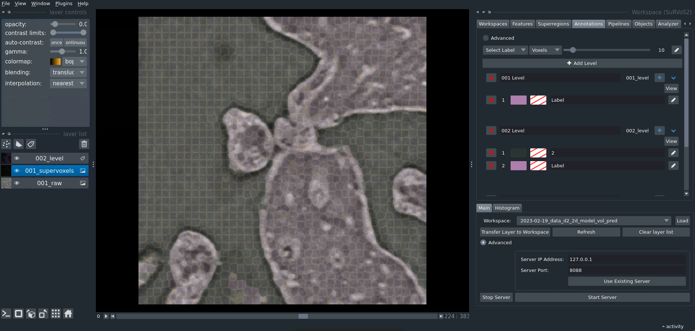

# SuRVoS2

SuRVoS2 is a software workbench for volumetric image segmentation. It provides a GUI interface for annotation-intensive segmentation projects, enabling a fast iterative process of annotation, model training, and segmentation evalutation. SuRVoS2 is part of the Napari ecosystem of image analysis tools and has an interface that tries to leverage the power of Napari for simplifying complex workflows.

## Installation

Please follow the instructions in INSTALL.txt

## Documentation

The [SuRVoS2 Tutorial] .

[SuRVoS2 on Docker]

## Contributing

Contributions are very welcome. Tests can be run with pytest, please ensure
the coverage at least stays the same before you submit a pull request.

## License

Distributed under the terms of the [Apache Software License 2.0] license,
"SuRVoS2" is free and open source software

## Issues

If you encounter any problems, please [file an issue] along with a detailed description.

[napari]: https://github.com/napari/napari
[@napari]: https://github.com/napari
[MIT]: http://opensource.org/licenses/MIT
[Apache Software License 2.0]: http://www.apache.org/licenses/LICENSE-2.0
[pip]: https://pypi.org/project/pip/
[PyPI]: https://pypi.org/
[SuRVoS2 Tutorial]: docs/Survos_Training_Sept_2022.pdf
[SuRVoS2 on Docker]: docs/Docker.md